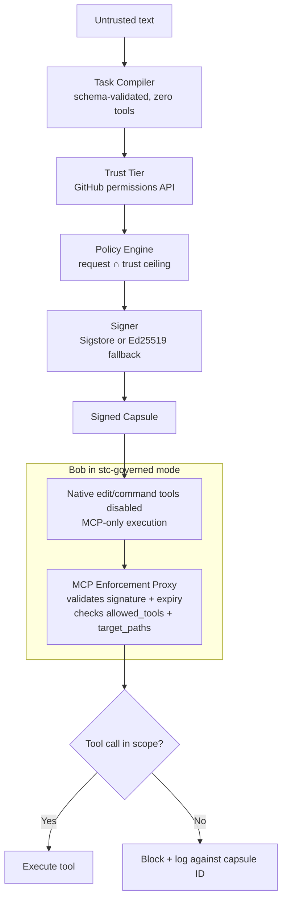

# Signed Task Capsules

**Bob never sees the raw issue or PR text.**  
It only ever acts on a cryptographically signed, policy-scoped **capsule** whose privileges were already capped by the author’s real GitHub permissions.

Signed Task Capsules is a governance layer that sits between untrusted repository text (issues, PR descriptions, comments) and IBM Bob. It turns an open-ended agent into an agent that can only execute a verified, least-privilege task contract.

---

## Why this exists

IBM Bob is designed to read complete repository context and carry a task through planning, execution, and validation. That is exactly the profile that indirect prompt injection targets: an agent that ingests everything and then acts.

Today the only boundary between a legitimate task and a malicious instruction hidden in an issue body is Bob’s own judgment. We move that boundary into an explicit, signed, policy-checked object — a **capsule** — that Bob is allowed to act on instead of raw text.

A cryptographic signature does **not** make the contents safe. It only proves the capsule was not tampered with after issuance and that it came from this pipeline. The real defenses sit upstream of signing:

1. The compiler has **no tools**. It can only emit a fixed JSON schema.
2. Privilege is capped by **source trust**, not by what the compiler claims the task needs. Trust tier is derived from GitHub’s collaborator/permission API *before* any capsule is signed. An external account is hard-capped regardless of what the LLM extracted.

---

## Core invariant



If a tool call is outside the capsule, it is blocked and logged against the capsule ID.

---

## Trust tiers

| Tier         | Who                              | Max scope                                              |
|--------------|----------------------------------|--------------------------------------------------------|
| **External** | Non-collaborator / first-time    | `read_file` only, ≤5 files, no network, no secrets     |
| **Contributor** | Verified past merged PR       | read + write + `run_tests`, ≤50 files, no network/secrets |
| **Maintainer**  | Repo admin/write access        | Full tool set; network / secrets / sensitive paths require human approval |

Human approval is also required when session history shows escalation (e.g. ≥3 capsules in the recent window, consecutive high-scope requests, or high cumulative tool diversity).

---

## Quick start

### Prerequisites
- Python 3.11+
- Docker (optional)

### Local

```bash
git clone <repository-url>
cd signed-task-capsules
cp .env.example .env          # fill in watsonx / GitHub / admin token
pip install -e .
uvicorn app.main:app --host 0.0.0.0 --port 8000
```

Generate an admin token if needed:

```bash
python -c "import secrets; print(secrets.token_hex(32))"
```

### Docker

```bash
docker-compose up --build
```

Service listens on `http://localhost:8000`.

---

## Bob integration (demo configuration)

Bob’s native file and command tools do **not** automatically route through MCP. For the demo we force the invariant using Bob’s own configuration:

**`.bob/custom_modes.yaml`** — `stc-governed` mode:
- Allows only `read` + `mcp` tool groups
- Explicitly excludes `edit` / `command` so native tools cannot bypass the proxy

**`.bob/mcp.json`** — registers the enforcement proxy as the `stc-enforcement-proxy` MCP server.

When Bob runs in `stc-governed` mode, every side-effecting action must go through the capsule-checked proxy. This is a deliberate, documented demo workaround. The production ask is native capsule verification inside Bob’s core tool path (see below).

---

## Demo scenarios

All scenarios live under `scripts/`.

| Scenario | What it shows |
|----------|----------------|
| **A** | Classic injection: PR/issue asks to read `.env` and exfiltrate. Capsule-gated path blocks it; baseline would not. |
| **B** | Second-order attack aimed at the compiler. Compiler emits an over-scoped request; trust-tier + policy down-scope or reject it *before* signing. |
| **C** | Slow escalation across multiple plausible requests from the same account. Session history triggers human approval. |
| **D** | Additional edge / approval flow coverage. |

Run:

```bash
python -m scripts.demo_scenario_a
# or
python -m scripts.demo
```

Success looks like: capsule issued with reduced scope, tool call to `.env` (or other denied path) returns blocked, audit log names the capsule ID and reason.

---

## API surface

| Method | Path | Purpose |
|--------|------|---------|
| `GET`  | `/` | Health |
| `POST` | `/webhook` | GitHub webhook ingestion (HMAC verified) |
| `POST` | `/capsules/{capsule_id}/approve` | Human approval of a pending capsule |
| `POST` | `/capsules/{capsule_id}/reject` | Human rejection of a pending capsule |
| `GET`  | `/audit` | Audit viewer (HTML) |
| `GET`  | `/api/audit` | Audit events (JSON) |
| `GET`  | `/api/audit/{capsule_id}` | Audit events for one capsule |
| `POST` | `/mcp` | Governed MCP tool execution (admin auth required) |

Admin/approval/audit/MCP endpoints require ADMIN_API_TOKEN (header or Bearer).

---

## Configuration

See `.env.example`. Important variables:

| Variable | Purpose |
|----------|---------|
| `LLM_API_KEY` / `WATSONX_*` | Compiler LLM (watsonx) |
| `SIGNING_METHOD` | `sigstore` or `ed25519` |
| `ED25519_PRIVATE_KEY_PATH` | Fallback key (chmod 0600 enforced) |
| `ADMIN_API_TOKEN` | Protects approval + audit |
| `GITHUB_WEBHOOK_SECRET` | HMAC verification |
| `GITHUB_APP_ID` / private key | Trust-tier lookup via GitHub API |
| `DATABASE_PATH` | SQLite (audit, sessions, pending) |
| `WORKSPACE_ROOT` | Root for governed file tools |
| `CAPSULE_EXPIRY_HOURS` | Capsule lifetime |

---

## Security properties (implemented)

- **Compiler isolation** — no tools, fixed JSON schema only
- **Pre-sign trust ceiling** — GitHub permission tier applied before signature
- **Runtime enforcement** — every MCP tool call checked against the active capsule
- **Path hardening** — `dir_fd` + `O_NOFOLLOW` walk on Linux/macOS (TOCTOU closed); lexical fallback on Windows (documented)
- **Network hardening** — host allowlist + private/reserved IP blocking on `net_request`
- **Sensitive path denial** — `.env*`, `secrets/`, `.git/`, key material patterns
- **Session-aware gates** — rate / escalation / tool-diversity triggers for human approval
- **Signing** — Sigstore keyless preferred; Ed25519 fallback with restricted key permissions
- **Audit** — append-only events keyed by capsule ID

---

## Known limitations (honest)

1. **Native Bob tools** — Without `stc-governed` mode, Bob can still call built-in file/command tools and bypass the proxy. Demo relies on the custom mode. Production fix: capsule verification inside Bob’s native tool execution path.
2. **Windows TOCTOU** — No `dir_fd` equivalent; falls back to resolve-then-open. Production target is the Linux container.
3. **Capsule binding** — Currently “latest active” rather than strictly per-thread. Thread-scoped binding is future work.
4. **Governed tool surface** — `read_file` / `write_file` are fully implemented behind the proxy; `execute_cmd` / `run_tests` / `net_request` are either restricted or intentionally report “no governed implementation” in some paths depending on configuration.
5. **Pending schema** — Some older databases may need a fresh file after column nullability changes.

Full detail: `docs/known-limitations.md` and `LEARNINGS.md`.

---

## Production asks (for IBM)

**Primary:**  
Integrate capsule verification into Bob’s core execution loop. Before any native tool runs, Bob verifies the active capsule (signature, expiry, trust-tier policy) and denies out-of-scope calls. This removes the need for the custom-mode workaround and keeps native performance.

**Secondary:**  
Propose an MCP capability-restriction handshake so an enterprise security component can declare lockdowns (e.g. disable untrusted network, restrict filesystem) at initialization time, making MCP suitable for zero-trust agent deployments.

---

## Development

```bash
pip install -e .
pytest tests/          # ~18 test modules, including race, network, session, webhook
```

Policy source of truth is dual:
- `policies/capsule.rego` + `policies/session.rego`
- Python mirror in `app/governance/policy.py`

Changes must stay consistent across both.

---

## Project layout

```
app/
  governance/     # compiler, policy, signer, session, verifier
  ingestion/      # webhook, trust tier, approval, GitHub client
  enforcement/    # MCP proxy, path utils, governed tool handler
  audit/          # logger + viewer
policies/         # Rego
scripts/          # demo scenarios A–D
tests/
.bob/             # custom mode + MCP registration for Bob
docs/
```

---

## License

[Add license]

---

**One-line summary for judges:**  
We replaced “Bob, please be careful with this issue body” with a signed, trust-capped task object that is the only thing the agent is allowed to see or execute.
